Partimos de las siguientes proposiciones (axiomas):

1. Existen dos elementos: $X = 1$ si $X \neq 0$ y $X = 0$ si $X = 0$
2. Existe el operador negación tal que: Si $X = 1 \implies \bar{X} = 0$ y si $X = 0 \implies \bar{X} = 1$
3. 
+ $0 \cdot 0 = 0$
+ $0 \cdot 1 = 0$
+ $1 \cdot 0 = 0$
+ $1 \cdot 1 = 1$
4. 
+ $0 + 0 = 0$
+ $0 + 1 = 1$
+ $1 + 0 = 1$
+ $1 + 1 = 1$
De los axiomas anteriores podemos deducir las siguientes propiedades:

| Propiedad | AND | OR |
| --- | --- | --- |
| Conmutativa | $X \cdot Y = Y \cdot X$ | $X + Y = Y + X$ |
| Asociativa | $(X \cdot Y) \cdot Z = X \cdot (Y \cdot Z)$ | $(X + Y) + Z = X + (Y + Z)$ |
| Distributiva | $X \cdot (Y + Z) = X \cdot Y + X \cdot Z$ | $X + (Y \cdot Z) = (X + Y) \cdot (X + Z)$ |
| Neutro | $X \cdot 1 = X$ | $X + 0 = X$ |
| Idempotencia | $X \cdot X = X$ | $X + X = X$ |
| Absorción | $X \cdot (X + Y) = X$ | $X + (X \cdot Y) = X$ |
| Inverso | $X \cdot \bar{X} = 0$ | $X + \bar{X} = 1$ |
| de Morgan | $\overline{X \cdot Y} = \bar{X} + \bar{Y}$ | $\overline{X + Y} = \bar{X} \cdot \bar{Y}$ |

# Ejercicio 0
Demostrar si la siguente igualdad entre funciones booleanas es verdadera o falsa:

$(X + \overline{Y}) = \overline{(\overline{X} \cdot Y)} \cdot Z + X \cdot \overline{Z} + \overline{(\overline{Y} + Z)}$
> Respuesta

$\overline{(\overline{X} \cdot Y)} \cdot Z + X \cdot \overline{Z} + \overline{(\overline{Y} + Z)}$

$\overline{(\overline{X} \cdot Y)} \cdot Z + X \cdot \overline{Z} + \overline{Y} \cdot \overline{Z}$

$\overline{(\overline{X} \cdot Y)} \cdot Z + (X + \overline{Y}) \cdot \overline{Z}$

$(X + \overline{Y}) \cdot Z + (X + \overline{Y}) \cdot \overline{Z}$

$(X + \overline{Y}) \cdot (Z + \overline{Z})$

$(X + \overline{Y}) \cdot 1$

$X + \overline{Y}$ Lo que queria demostrar.

## Notación 
En el lenguaje coloquial vamos a llamar a las operaciones indistintamente de la siguiente forma:
 + $A + B \implies A \ \text{OR} \ B$
 + $A \cdot B \implies A \ \text{AND} \ B$
 + $\overline{A} \implies \ \text{NOT} \ A$
 + $A \oplus B \implies A \ \text{XOR} \ B$
 + $A \odot B \implies A \ \text{XNOR} \ B$

# Compuertas
Son modelos idealizados de dispositivos electrónicos que permiten implementar las operaciones lógicas.

Lo podemos representar gráficamente:
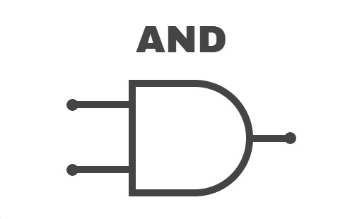
O describir mediante un lenguaje de descripción de hardware (HDL), por ejemplo en SistemVerilog.

```systemverilog
assign o = A and B;
```

Son representaciónes que nos permiten observar todas las salidas para todas las posibles combinaciones de entradas.

Por ejemplo, la función del ejercicio ($F = X + \overline{Y}$) se reprensenta:

| X | Y | F |
| --- | --- | --- |
| 0 | 0 | 1 |
| 0 | 1 | 0 |
| 1 | 0 | 1 |
| 1 | 1 | 1 |

## Compuerta NOT
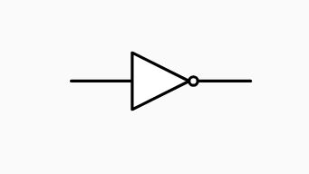

Tabla de verdad:
| A | NOT A |
| --- | --- |
| 0 | 1 |
| 1 | 0 |
En sistemverilog:

```systemverilog
assing o = ~a;
```
## Compuerta AND
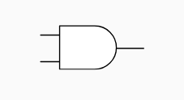

Tabla de verdad:
| A | B | A AND B |
| --- | --- | --- |
| 0 | 0 | 0 |
| 0 | 1 | 0 |
| 1 | 0 | 0 |
| 1 | 1 | 1 |
En sistemverilog:

```systemverilog
assign o = a & b;
```
## Compuerta OR
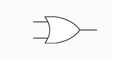

Tabla de verdad:
| A | B | A OR B |
| --- | --- | --- |
| 0 | 0 | 0 |
| 0 | 1 | 1 |
| 1 | 0 | 1 |
| 1 | 1 | 1 |
En sistemverilog:

```systemverilog
assign o = a | b;
```
## Compuerta XOR o OR exclusiva
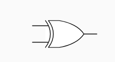

Tabla de verdad:
| A | B | A XOR B |
| --- | --- | --- |
| 0 | 0 | 0 |
| 0 | 1 | 1 |
| 1 | 0 | 1 |
| 1 | 1 | 0 |

En sistemverilog:

```systemverilog
assign o = a ^ b;
```
# Entradas y salidas - Categorización 
Por el momento vamos a querer abstraer nuestros circuitos en módulos de los cuales observaremos solamente sus entradas y salidas. 

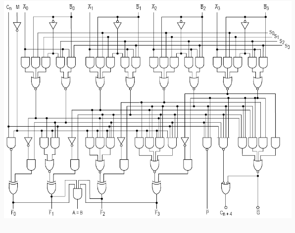

Aplicando lo anterior, podemos trabajar con la ALU (Aritmetic Logic Unit) viéndola de la siguiente manera:

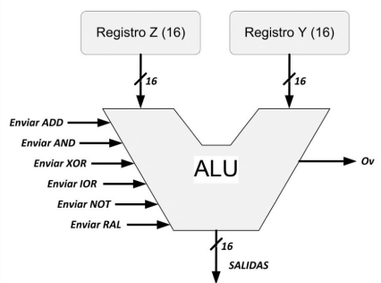

En la ALU anterior representa con flechas...

En SystemVerilog:

```systemverilog
module ALU #(parameter DATA_WIDTH = 16)
    (input [DATA_WIDTH-1:0] operadorZ,
     input [DATA_WIDTH-1:0] operadorY, 
     input [1:0] opcode, 
     output [DATA_WIDTH-1:0] salidas,
     output overflow)
endmodule;
```

En la ALU, ¿son funcionalmente todas iguales las entradas y las salidas?
NO

# Lógica proposicional a circuitos combinatorios:
El estudio de la lógica propocional y del álgebra de Boole tiene que ver con que vamos a querer implementar funciones lógicas en nuestro soporte electrónico con circuitos combinatorios.

El mecanismo es el siguiente:
+ Si tenemos una fórmula $\Phi$ que se expresa en función de las variables $x_1, x_2, \dots, x_n$ (las entradas).
+ Construiremos una tabla de verdad con una fila para cada combinación posible de las entradas y en la columna de la salida y en la columna de salida y ingresamos el valor de la fórmula evaluada en esos valores $\Phi(x_1, x_2, \dots, x_n)$
+ Vamos a utilizar solamente las filas en las que la función vale 1.
+ Para cada fila $i$ en la que $\phi$ es verdadera (vale 1) vamos a contruir un término $t_i$ como conjunción (y lógico o AND) de todas las entradas, donde cada variable aparece negada si su valor era 0 en la fila y sin negar en el caso contrario.
+ Por ejemplo, si en la fila 4 la asignación de las variables era $x_1=1, x_2=0, \dots, x_n=0$ entonces el término será $x_1 \land \neg x_2 \land \dots \land x_n$
+ Finalmente, la función será la disyunción (o lógico o OR) de todos los términos $t_i$ obtenidos.
+ Una vez que tenemos los términos $t_i, t_j, \dots$ para cada fila en la que la función vale 1, vamos a hacer una disyunsión (o logico u OR) de todos los términos $\phi'= t_i \lor t_j \lor \dots$
+ A este mecanismo se lo conoce como suma de productos y nos da una expresión de $\phi$ o de la tabla de verdad que puede traducirse fácilmente a un circuito combinatorio.

## Ejemplo:
La fórmula ($F = X + \overline{Y}$) se representa:

| X | Y | F |
|---|---|---|
| 0 | 0 | 1 |
| 0 | 1 | 0 |
| 1 | 0 | 1 |
| 1 | 1 | 1 |

En este caso los términos serían:

$t_1 = \neg X \land \neg Y$

$t_3 = X \land \neg Y$

$t_4 = X \land Y$

Y la función sería:

$\Phi´ = t_1 \lor t_3 \lor t_4 = (\neg X \land \neg Y) \lor (X \land \neg Y) \lor (X \land Y)$
A esta expresión se conoce como suma de productos.

## Ejercicio
Armar un sumador de 1 bit. Tiene que tener dos entradas de un bit y dos salidas, una para el resultado y otra para indicar si hubo acarreo.

Respuesta:
| X | Y | Suma | Acarreo |
|---|---|---|---|
| 0 | 0 | 0 | 0 |
| 0 | 1 | 1 | 0 |
| 1 | 0 | 1 | 0 |
| 1 | 1 | 0 | 1 |

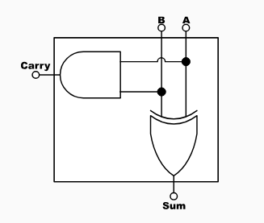

# Ejercicio
Teniendo dos sumadores simples (de 1 bit) y sólo una compuerta a elección, arme un sumador completo. El mismo tiene dos entradas de 1 bit y una tercer entrada interpretada como $C_{in}$ tiene como salida $C_{out}$ y una salida para el resultado $S$.

| $C_{in}$ | X | Y | S | $C_{out}$ |
|---|---|---|---|---|
| 0 | 0 | 0 | 0 | 0 |
| 0 | 0 | 1 | 1 | 0 |
| 0 | 1 | 0 | 1 | 0 |
| 0 | 1 | 1 | 0 | 1 |
| 1 | 0 | 0 | 1 | 0 |
| 1 | 0 | 1 | 0 | 1 |
| 1 | 1 | 0 | 0 | 1 |
| 1 | 1 | 1 | 1 | 1 |

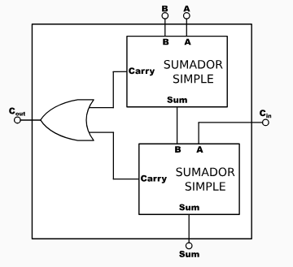

# Ejercicio
Armar un circuito de 3 bits. Este deberá mover de izquierda o a derecha los bits de entrada de acuerdo al valor de entrada extra que actúa como control. En otras palabras, un shift izq-der de k-bits es un circuito de k + 1 entradas ($e_k, \dots, e_0$) y k salidas ($S_{k-1}, \dots, S_0$) que funciona del siguiente modo:

+ Si $e_k = 1$, entonces $s_i = e_{i-1}$ para todo $0 < i < k$ y $s_0 = 0$
+ Si $e_k = 0$, entonces $s_i = e_{i+1}$ para todo $0 < i < k$ y $s_{k-1} = 0$

Ejemplos:
+ $shift_lr(0, 1101)_2 = (0110)_2$
+ $shift_lr(1, 1101)_2 = (1101)_2$

Solución:

$S_2 = 
\begin{bmatrix} 
0 & \text{si} e_3 = 0 \\
e1 & \text{si} e_3 = 1 
\end{bmatrix} = e_3 \cdot e_1$


$S_1 = 
\begin{bmatrix} 
0 & \text{si} e_3 = 0 \\
e2 & \text{si} e_3 = 1 
\end{bmatrix} = \overline{e_3} \cdot e_1$

$S_0 = 
\begin{bmatrix} 
0 & \text{si} e_3 = 0 \\
e1 & \text{si} e_3 = 1 
\end{bmatrix} = e_3 + e_0 +  \overline{e_3} \cdot e_2$
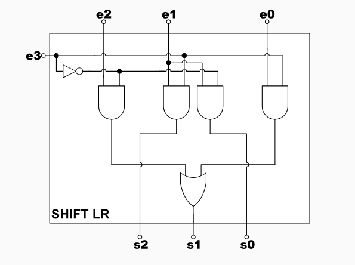

Más combinatorios: Multiplexor y Demultiplexor
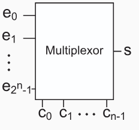

Las lineas de control C permiten seleccionar una de las entradas e, la que corresponderá a la salida s.

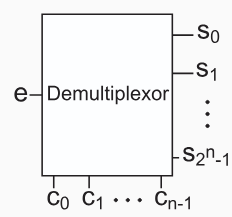

Las líneas de control c permiten seleccionar cual de las salidas s tendrá el valor de e.
Una y sólo una línea en alto de e corresponderá a una combinación en la salida s.
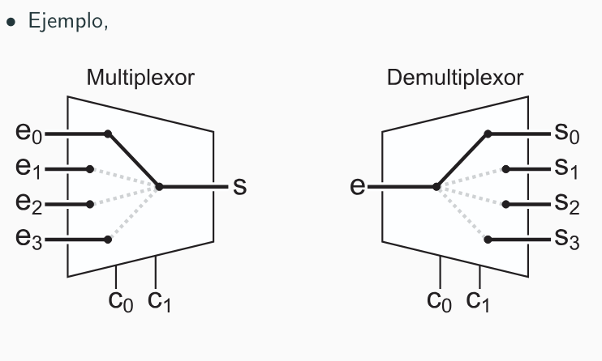

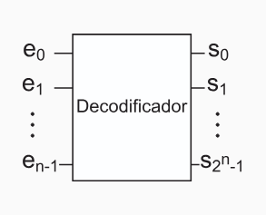

Cada cominación de las líneas e corresponderán a una sola línea en alto de la salida S.

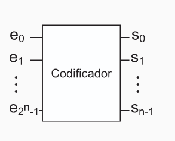

Una y sólo una línea en alto de e corresponderá a una combinación en la salida s.

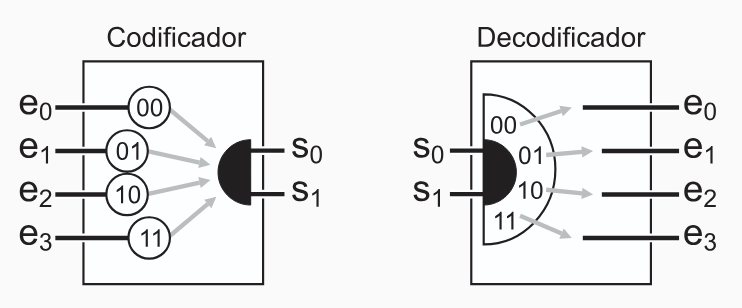
# Timing
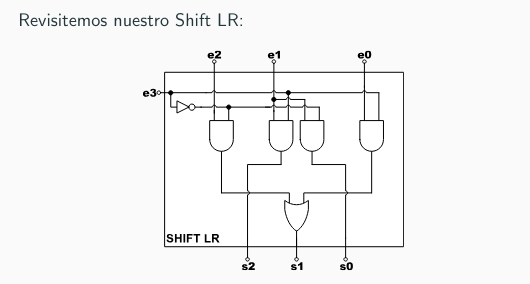
Para el circuito Shift LR anterior, supongamos (de forma optimista) que todas las compuertas tardan 10ps en poner un resultado válido en sus salidas. A partir de ello, dibujemos el diagrama de tiempos para cuando todas las entradas cambian simultaneamente de 0 a 1.

Diagrama de tiempos:

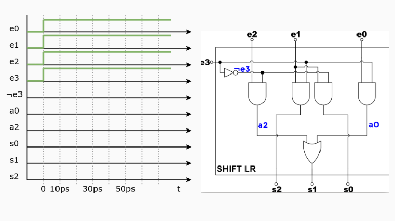

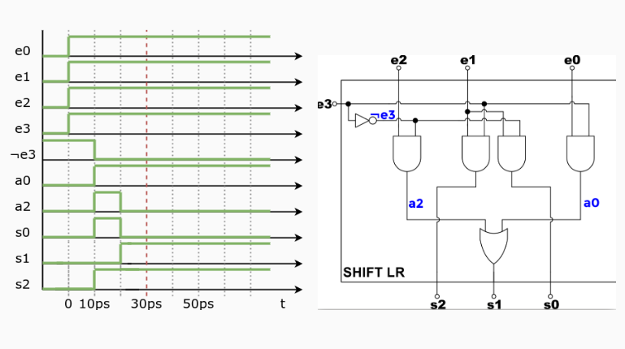

¿Cuál es el mínimo tiempo que se debe esperar para leer un resultado válido de su salida?
+ En un circuito combinatorio el tiempo que tarda en estabilizarse depende de la cantidad de capas de compuertas (latencia)
+ En este caso debemos esperar al menos $3 \cdot 10ps = 30ps$ para leer un resultado válido de su salida.

# Latchs 
Son circuitos que permiten trabajar o asegurar el valor de salida.
+ Permiten el cambio de sus salidas según el nivel de las entradas.
+ Utilizan retor alimentación
Ejemplo latch RS implementado con NOR: 
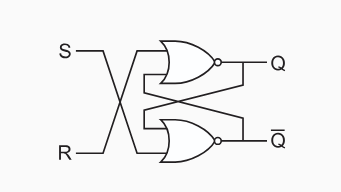

Tabla de verdad:
| S | R | Q | Q' |
|---|---|---|---|
| 1 | 0 | 1 | 0 |
| 0 | 1 | 0 | 1 |
| 0 | 0 | Q* | Q'*1 |
| 1 | 1 | 0 | 0 |
> Se recomienda empezar con S,R = (1,0) y luego S,R = (0,1)

> En este caso Si hay un 0 en S o en R el latch cambia de estado. Y si hay un 1 en S y R el latch no cambia de estado.

> Q* y Q'*1 son los valores que tenía Q y Q' antes de que S y R cambien.

Con S,R = (1,1):
+ El valor de las salidas es inconsistente con la especificación
+ El valor de las salidas depende de la implementación